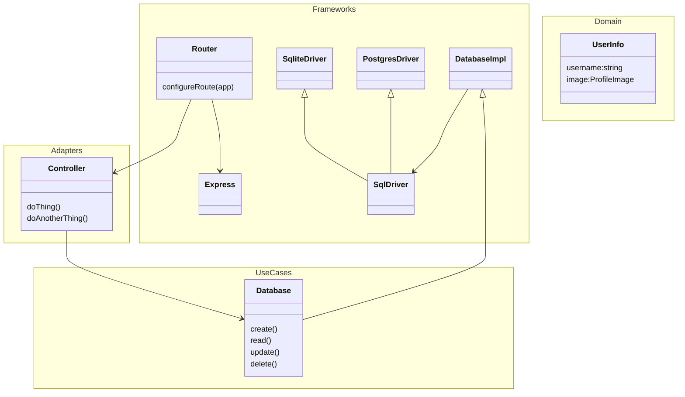
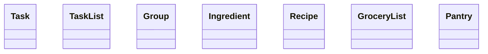

# Auth-Server
Pointyware Auth Server

## Install Steps

```bash
# Update System
sudo apt update && sudo apt upgrade -y

# Install Node
curl -fsSL https://deb.nodesource.com/setup_lts.x

# Install Nginx
sudo apt install -y nginx

# Install SQLite
sudo apt install -y sqlite3

# Install PM2
sudo npm install -g pm2

# Install Cerbot
sudo apt install -y certbot python3-certbox-nginx

echo "Setup complete! Node version: $(node --version)"

```

## Architecture

The network interface acts as our ultimate input and output with the outside world, shaping the client, or user, interface. Instead of mouse and keyboard events driving changes, the events we respond to are incoming requests from the network, the model we update is typically held in database, and instead of a screen to output the results, we return the results through network responses directed back at the original sender. Despite the vastly different environment, the same architectural layering principles familiar in front-end development provide the same maintenance benefits in back-end development. The general process is as follows:

1. A request comes in to the application and is routed to the appropriate adapter according to the Router Logic.
2. The Adapters first main component, the RequestMapper, produces a command or query object that represents some operation within the domain.
3. The Adapter's second main component, the Interpreter, translates the command or query object into an actual domain operation with the help of Interactors
  1. Use Cases implement the business logic or program policies
  2. These policies describe how to manipulate the domain model, usually through repositories, databases, or other data layer abstractions
    1. The data abstraction receives one or more mutation commands or getter queries and fullfils them as it can.
    2. The data layer returns either confirmation that the process completed successfully.
  3. Use Cases return a Result describing the outcome of the operation.
5. The Adapter's final main component, the ResponseMapper, takes the Result from the Interpreter and maps it to a response object.
6. The original routing layer finally receives the response object and binds it to the network response object to send the response to the user.
  - to manipulate the domain model, usually through repositories, databases, or other data layer abstractions

Components:
1. Router(s): Path, Method
2. Adapters: RequestMapper, Interpreter, ResponseMapper
3. Interactors: UseCases, Repository/Database/Auth Interfaces
4. Data: Repositories and Databases

Currently, the Frameworks and Drivers layer is bleeding into the adapter layer, making the adapters directly dependent on a specific framework, Express. It would be preferable if the Adapters did not depend on Express and instead defined their own signatures to accept inputs from other frameworks.




### Patterns

**Page Adapter (Controller)[^fowler-page-controller]**

Instead of using a true controller that has knowledge of the framework layer within the adapter layer, we use a clean adapter with no knowledge of outer layers.

```mermaid
classDiagram
  class 
```

**Chain of Responsibility[^guru-chain]**


**Repository[^fowler-repository]** - 


**Table Data Gateway[^fowler-table-gateway]**


**Data Mapper[^fowler-data-mapper]** - 


**Query Object[^fowler-query-object]** - 

**Handler

**Service Stub[^fowler-service-stub]** - 

For test stability and speed and short time-to-first-feature, I frequently use service stubs

[^fowler-page-controller]: https://martinfowler.com/eaaCatalog/pageController.html
[^fowler-service-stub]: https://martinfowler.com/eaaCatalog/serviceStub.html
[^guru-chain]: https://refactoring.guru/design-patterns/chain-of-responsibility

[^fowler-repository]: https://martinfowler.com/eaaCatalog/repository.html
[^fowler-table-gateway]: https://martinfowler.com/eaaCatalog/tableDataGateway.html
[^fowler-table-module]: https://martinfowler.com/eaaCatalog/tableModule.html

[^fowler-data-mapper]: https://martinfowler.com/eaaCatalog/dataMapper.html
[^fowler-query-object]: https://martinfowler.com/eaaCatalog/queryObject.html


### Theory

Comment:
- text:string
- children:Comment[]

Feed:
- title:string
- enabled:boolean
- comments:Comment[]


RESTful APIs are meant to represent resources and their manipulation
A fundamental decision in the manipulation of different properties is their data type, or structure, 
Since POST, GET, PUT/PATCH, DELETE roughly correspond to Create, Read, Update, Delete, I think it makes sense to design an API by thinking about each endpoint like a resource and trying to assign a type that gives better semantic reasoning to each of the HTTP methods.
/set-resource: Set[Type]
- POST adds a new element of Type to the set
- GET gets the elements in the set (allows filtering)
- PUT override an existing element in the set
- DELETE remove an element from the set
/list-resource: List[Type]
- POST adds a new element of Type to the list
- GET gets the elements in the list (allows filtering)
- PUT override an existing element at a position in the list
- DELETE remove an element at a position OR remove all instances of an element
/map-resource: Map[Key, Value]
- POST adds a new element as a value and returns the key
- GET gets the elements in the map (allows filtering)
- -key
  - PUT update specific value at key
  - DELETE delete specific value at key

Creates endpoints:
- /feeds: Set[Feed]
  - POST create new comment feed
  - GET get list of feeds (scoped to user access)
  - /feed-:feedId
    - PUT modify comment feed
    - DELETE remove comment feed
    - /comments
      - POST create a new comment
      - GET 
- /comments
  // Feeds
  - POST /feed create new comment feed
  - GET /feed-UUID get comment feed details
  - PUT /feed-UUID update comment feed details
  - DELETE /feed-UUID delete comment feed
  // Comments
  - /feed-UUID - ``
    - POST: create new comment on feed
    - GET: get comments on feed
  - /comment-UUID
    - POST: create new comment on comment
    - GET: get specific comment
    - PUT: update comment
    - DELETE: delete comment
  // Users
  - /user-UUID - `View()`
    - GET: get comments by user
    - POST,PUT,DELETE are all nonsense
  - DELETE /comment-UUID delete specific comment
  - 



TODO: include Zod
1. validate request data in adapter layer and return 400 with schema validation errors if invalid
2. use validated data to map to service models
3. bind service response to http response with appropriate status codes
