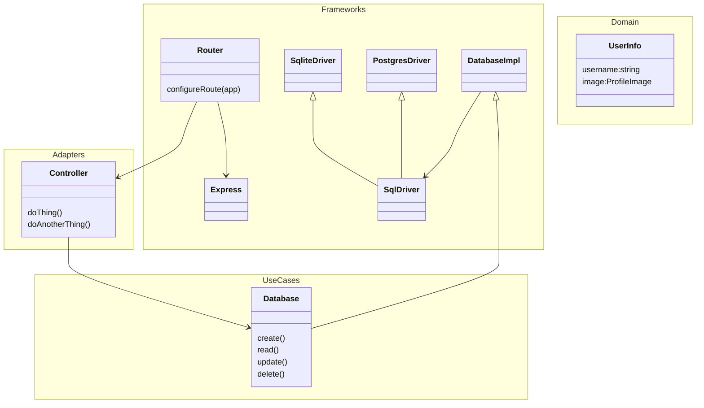

# Auth-Server
Pointyware Auth Server

## Install Steps

```bash
# Update System
sudo apt update && sudo apt upgrade -y

# Install Node
curl -fsSL https://deb.nodesource.com/setup_lts.x

# Install Nginx
sudo apt install -y nginx

# Install SQLite
sudo apt install -y sqlite3

# Install PM2
sudo npm install -g pm2

# Install Cerbot
sudo apt install -y certbot python3-certbox-nginx

echo "Setup complete! Node version: $(node --version)"

```

## Architecture

The network interface acts as our ultimate input and output with the outside world, shaping the client, or user, interface. Instead of mouse and keyboard events driving changes, the events we respond to are incoming requests from the network, the model we update is typically a database, and instead of a screen to output the results, we return the results through network responses directed back at the original sender. Despite the vastly different environment, the same architectural layering principles familiar in front-end devlopment provide the same maintenance benefits in back-end development. The general process is as follows:

1. A request comes in to the server network interface
2. The router (or routers) take care of marshalling the data in the request into the appropriate business models and sending them to the appropriate controller. Business models need not be entirely separate entites – well defined function interfaces work just fine for this connection.
3. The controller acts on the business models passed to it to update the server's model (usually a database)
4. The controller returns a response – at least a confirmation of success, but in RESTful APIs, it will usually return the updated state.
5. The router, having received the response from the controller, marshalls the entity data into a new network response and sends it off.



### Theory

Comment:
- text:string
- children:Comment[]

Feed:
- title:string
- enabled:boolean
- comments:Comment[]


RESTful APIs are meant to represent resources and their manipulation
A fundamental decision in the manipulation of different properties is their data type, or structure, 
Since POST, GET, PUT/PATCH, DELETE roughly correspond to Create, Read, Update, Delete, I think it makes sense to design an API by thinking about each endpoint like a resource and trying to assign a type that gives better semantic reasoning to each of the HTTP methods.
/set-resource: Set[Type]
- POST adds a new element of Type to the set
- GET gets the elements in the set (allows filtering)
- PUT override an existing element in the set
- DELETE remove an element from the set
/list-resource: List[Type]
- POST adds a new element of Type to the list
- GET gets the elements in the list (allows filtering)
- PUT override an existing element at a position in the list
- DELETE remove an element at a position OR remove all instances of an element
/map-resource: Map[Key, Value]
- POST adds a new element as a value and returns the key
- GET gets the elements in the map (allows filtering)
- -key
  - PUT update specific value at key
  - DELETE delete specific value at key

Creates endpoints:
- /feeds: Set[Feed]
  - POST create new comment feed
  - GET get list of feeds (scoped to user access)
  - /feed-:feedId
    - PUT modify comment feed
    - DELETE remove comment feed
    - /comments
      - POST create a new comment
      - GET 
- /comments
  // Feeds
  - POST /feed create new comment feed
  - GET /feed-UUID get comment feed details
  - PUT /feed-UUID update comment feed details
  - DELETE /feed-UUID delete comment feed
  // Comments
  - /feed-UUID - ``
    - POST: create new comment on feed
    - GET: get comments on feed
  - /comment-UUID
    - POST: create new comment on comment
    - GET: get specific comment
    - PUT: update comment
    - DELETE: delete comment
  // Users
  - /user-UUID - `View()`
    - GET: get comments by user
    - POST,PUT,DELETE are all nonsense
  - DELETE /comment-UUID delete specific comment
  - 


TODO: include Zod
1. validate request data in adapter layer and return 400 with schema validation errors if invalid
2. use validated data to map to service models
3. bind service response to http response with appropriate status codes
