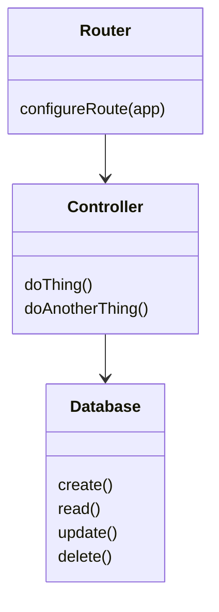

# Auth-Server
Pointyware Auth Server

## Install Steps

```bash
# Update System
sudo apt update && sudo apt upgrade -y

# Install Node
curl -fsSL https://deb.nodesource.com/setup_lts.x

# Install Nginx
sudo apt install -y nginx

# Install SQLite
sudo apt install -y sqlite3

# Install PM2
sudo npm install -g pm2

# Install Cerbot
sudo apt install -y certbot python3-certbox-nginx

echo "Setup complete! Node version: $(node --version)"

```

## Architecture

The network interface acts as our ultimate input and output with the outside world, shaping the client, or user, interface. Instead of mouse and keyboard events driving changes, the events we respond to are incoming requests from the network, the model we update is typically a database, and instead of a screen to output the results, we return the results through network responses directed back at the original sender. Despite the vastly different environment, the same architectural layering principles familiar in front-end devlopment provide the same maintenance benefits in back-end development. The general process is as follows:

1. A request comes in to the server network interface
2. The router (or routers) take care of marshalling the data in the request into the appropriate business models and sending them to the appropriate controller. Business models need not be entirely separate entites – well defined function interfaces work just fine for this connection.
3. The controller acts on the business models passed to it to update the server's model (usually a database)
4. The controller returns a response – at least a confirmation of success, but in RESTful APIs, it will usually return the updated state.
5. The router, having received the response from the controller, marshalls the entity data into a new network response and sends it off.


